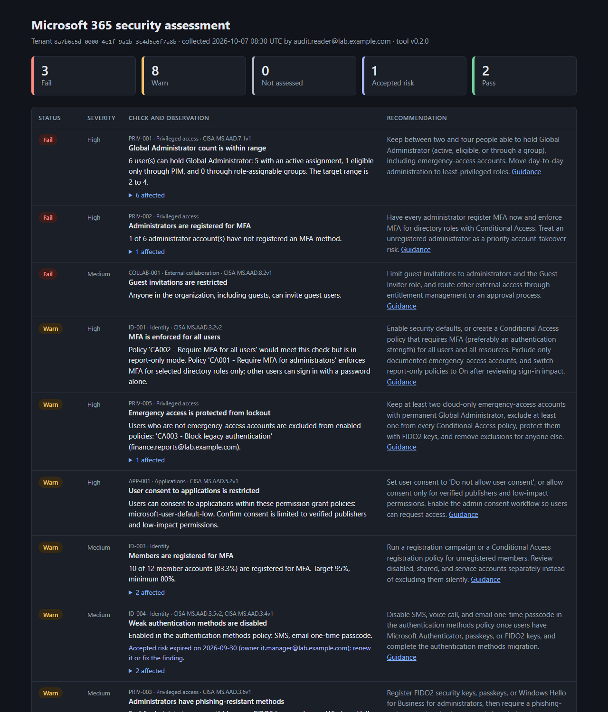

# 04 — M365 Security Assessment

**Status:** v0.2 — fourteen read-only checks, accepted risks, drift comparison, and CISA SCuBA mapping

This tool reviews a Microsoft 365 tenant's Microsoft Entra ID configuration and reports what an attacker would look for first: accounts that can sign in with only a password, too many or poorly protected Global Administrators, standing admin access, weak MFA methods, users who can grant apps access to company data, and open guest access. It reads configuration through Microsoft Graph, **never changes anything**, and writes CSV, JSON, and HTML reports with a recommendation, Microsoft Learn reference, and CISA SCuBA baseline ID for every finding.

Run it again later and it shows **what changed since the last assessment**. Known, approved exceptions can be recorded as **accepted risks** with an owner and expiry date, so they stop cluttering the report without being forgotten.



The [full sample report](screenshots/sample-report-full.png) includes the "changes since" section.

## Who it is for

An administrator, consultant, or managed service provider who needs a repeatable baseline after onboarding a tenant, before a deeper review, or on a schedule to catch configuration drift. The HTML report is written for an IT manager; the CSV and JSON are for tracking, comparison, and import into other tools.

## Try it without a tenant

A fictional tenant is included: two snapshots a month apart and a configuration file. From the repository root:

```powershell
./projects/04-m365-security-assessment/src/Invoke-M365SecurityAssessment.ps1 `
    -SnapshotPath ./projects/04-m365-security-assessment/examples/sample-tenant-snapshot.json `
    -CompareToSnapshotPath ./projects/04-m365-security-assessment/examples/sample-tenant-snapshot-previous.json `
    -ConfigurationPath ./config/m365-security-assessment.example.json
```

The run prints a summary and the regressions since the previous month, and writes timestamped reports to `projects/04-m365-security-assessment/output/`. Ready-made results are in [`examples/sample-report.html`](examples/sample-report.html), [`examples/sample-report.csv`](examples/sample-report.csv), and [`examples/sample-drift.csv`](examples/sample-drift.csv).

In the sample, someone switched the all-users MFA policy to report-only, added a Global Administrator who never registered MFA, excluded an old service account from the legacy-authentication block, and opened guest invitations to everyone. The drift section shows each of those changes next to the findings they caused.

## Checks

| ID | Check | Severity | Pass | Warn | Fail | Baseline |
| --- | --- | --- | --- | --- | --- | --- |
| ID-001 | MFA is enforced for all users | High | Security defaults on, or an enabled Conditional Access policy requires MFA or an authentication strength for all users and all resources | A qualifying policy is report-only, or MFA covers only selected admin roles | Neither | MS.AAD.3.2v2 |
| ID-002 | Legacy authentication is blocked | High | Security defaults on, or an enabled policy blocks Exchange ActiveSync **and** other clients for all users | A qualifying policy is report-only | Neither | MS.AAD.1.1v1 |
| ID-003 | Members are registered for MFA | Medium | ≥ 95% of member accounts | ≥ 80% | < 80% | — |
| ID-004 | Weak authentication methods are disabled | Medium | SMS, voice call, and email OTP disabled; migration complete | Any of them enabled, or the methods migration is incomplete | — | MS.AAD.3.5v2, MS.AAD.3.4v1 |
| ID-005 | Self-service password reset is enabled and registered | Low | ≥ 95% of SSPR-enabled non-admin members registered, and all are enabled | SSPR off, scoped to some members, or ≥ 80% registered | < 80% | — |
| PRIV-001 | Global Administrator count is within range | High | 2–4 people can hold the role (active, PIM-eligible, or through a group) | Fewer than 2, or group members or service principals could not be counted | More than 4 | MS.AAD.7.1v1 |
| PRIV-002 | Administrators are registered for MFA | High | Every admin registered | — | Any admin unregistered | — |
| PRIV-003 | Administrators have phishing-resistant methods | Medium | Every admin has FIDO2, a passkey, or Windows Hello for Business | Any admin without one | — | MS.AAD.3.6v1 |
| PRIV-004 | Global Administrator access is just-in-time | Medium | Only emergency-access accounts have permanent assignments | Anyone else has standing (non-PIM) access | — | MS.AAD.7.4v1 |
| PRIV-005 | Emergency access is protected from lockout | High | Configured accounts hold Global Administrator, one is excluded from every policy that applies to them, nobody else is excluded | A policy applies to every emergency account, other users are excluded, or only one account is configured | A configured account doesn't hold the role | — |
| APP-001 | User consent to applications is restricted | High | User consent disabled | Consent limited by a policy such as `microsoft-user-default-low` | Legacy policy: users can consent to any app | MS.AAD.5.2v1 |
| APP-002 | Users cannot register applications | Medium | Disabled | Enabled | — | MS.AAD.5.1v1 |
| COLLAB-001 | Guest invitations are restricted | Medium | Admins and Guest Inviters only, or disabled | All members can invite | Everyone, including guests, can invite | MS.AAD.8.2v1 |
| COLLAB-002 | Guest directory access is restricted | Low | Restricted to own objects | Limited (Microsoft default) | Same access as members | MS.AAD.8.1v1 |

Baseline IDs refer to the public [CISA SCuBA Microsoft Entra ID baseline](https://github.com/cisagov/ScubaGear/blob/main/PowerShell/ScubaGear/baselines/aad.md). Some defaults here are stricter than SCuBA: it allows up to eight Global Administrators and accepts "limited" guest access. Adjust the thresholds or record an accepted risk if you follow SCuBA exactly.

Each finding has one of five statuses:

- **Fail** or **Warn**: the setting needs attention.
- **NotAssessed**: the data for that check could not be collected (for example, a missing permission or license). The tool never guesses a result, and one failed data source does not stop the rest of the assessment.
- **Accepted**: the finding matches a current, approved exception in the configuration file. The original status is kept in `OriginalStatus`.
- **Pass**.

## Configuration file

Each tenant can have a configuration file. Start by copying [`config/m365-security-assessment.example.json`](../../config/m365-security-assessment.example.json). Files in `config/` other than `*.example.json` are excluded from Git because they list account names.

```json
{
  "SchemaVersion": 1,
  "TenantId": "<tenant GUID>",
  "EmergencyAccessAccounts": [ "breakglass-01@contoso.com", "breakglass-02@contoso.com" ],
  "Thresholds": { "MaximumGlobalAdmins": 4, "MfaRegistrationTargetPercent": 95 },
  "AcceptedRisks": [
    {
      "CheckId": "PRIV-003",
      "AffectedObjects": [ "helpdesk.lead@contoso.com" ],
      "Reason": "FIDO2 key ordered; uses an OATH token until it arrives.",
      "Owner": "security.lead@contoso.com",
      "Expires": "2026-12-31",
      "Ticket": "RISK-21"
    }
  ]
}
```

- **TenantId** (optional) stops the file from being applied to the wrong tenant's snapshot.
- **EmergencyAccessAccounts** enables PRIV-005 and excludes these accounts from PRIV-004. Without it, PRIV-005 reports NotAssessed.
- **Thresholds** override the defaults. Command-line parameters override the file.
- **AcceptedRisks** require a `CheckId`, `Reason`, `Owner`, and `Expires` date (`yyyy-MM-dd`). How a risk applies:
  - **Without `AffectedObjects`**, it covers the whole check.
  - **With `AffectedObjects`**, it applies only while every affected account is on the list. A new account appearing brings the finding back, with a note saying which accounts are not covered.
  - **Expiry** is checked against the snapshot's collection date, so re-running an old snapshot gives the same answer. An expired risk no longer applies, and the finding shows a note asking for renewal.
  - **No longer needed:** a risk for a check that now passes is flagged so you can remove it.
- Invalid files are rejected, with every problem listed at once.

## Requirements

- PowerShell 7.2 or newer.
- For live runs, the Microsoft Graph authentication module:

```powershell
Install-Module Microsoft.Graph.Authentication -Scope CurrentUser
```

- An account with the **Global Reader** role (recommended). The script requests these delegated, read-only scopes, which may need admin consent the first time:

| Scope | Used for |
| --- | --- |
| `Policy.Read.All` | Security defaults, Conditional Access, authorization policy, authentication methods policy |
| `RoleManagement.Read.Directory` | Global Administrator members, PIM active and eligible assignments |
| `AuditLog.Read.All` | User registration details (MFA, SSPR, and method registration) |
| `GroupMember.Read.All` | Members of role-assignable groups that hold Global Administrator |

License-dependent data:

- The registration details report [requires Microsoft Entra ID P1 or P2](https://learn.microsoft.com/en-us/entra/identity/authentication/howto-authentication-methods-activity#permissions-and-licenses).
- PIM assignment data requires Microsoft Entra ID P2 or Microsoft Entra ID Governance.

Without these licenses, the checks that depend on that data report NotAssessed (ID-003, ID-005, PRIV-002, PRIV-003, PRIV-004) and the others still run.

## Run against a tenant

```powershell
./projects/04-m365-security-assessment/src/Invoke-M365SecurityAssessment.ps1 -SaveSnapshot `
    -ConfigurationPath ./config/contoso.json
```

Complete the device-code sign-in for the tenant you are authorized to assess. Useful options:

| Parameter | Effect |
| --- | --- |
| `-SaveSnapshot` | Saves the raw configuration as JSON next to the reports. Keep it, so the next run can compare against it. |
| `-CompareToSnapshotPath` | Adds a "changes since" section to the HTML and JSON and writes a `...-Drift-<timestamp>.csv`. |
| `-FailOnSeverity High` | Exits with code 1 if any check at or above that severity fails, for scheduled runs and pipelines. Warn, NotAssessed, and Accepted never fail the run. |
| `-TenantId`, `-OutputDirectory`, `-Format`, `-PassThru` | Target tenant, report location, formats to write, and return the findings to the pipeline. |

The script warns if any requested scope was not granted and disconnects from Graph when it finishes. A monthly routine looks like this:

```powershell
$assess = './projects/04-m365-security-assessment/src/Invoke-M365SecurityAssessment.ps1'
$last = Get-ChildItem ./projects/04-m365-security-assessment/output/M365-Security-Snapshot-*.json |
    Sort-Object Name | Select-Object -Last 1
& $assess -SaveSnapshot -ConfigurationPath ./config/contoso.json -CompareToSnapshotPath $last.FullName
```

The functions are also available as a module:

```powershell
Import-Module ./projects/04-m365-security-assessment/src/M365SecurityAssessment.psd1
Connect-MgGraph -Scopes Policy.Read.All, RoleManagement.Read.Directory, AuditLog.Read.All, GroupMember.Read.All
$configuration = Import-M365SecurityConfiguration -Path ./config/contoso.json
$snapshot = Get-M365SecuritySnapshot
$findings = $snapshot | Get-M365SecurityFinding -Configuration $configuration
$changes = Compare-M365SecuritySnapshot -ReferenceSnapshot (Import-M365SecuritySnapshot ./last.json) -DifferenceSnapshot $snapshot -Configuration $configuration
$changes | Where-Object ChangeType -in 'Regressed', 'NewlyAffected' | Format-Table ChangeType, Item, Before, After
```

## Drift comparison

`Compare-M365SecuritySnapshot` evaluates both snapshots with the same configuration and returns one row per change:

| Area | Change types |
| --- | --- |
| Findings | `Regressed` or `Improved` (Fail ↔ Warn ↔ Pass), `Changed` (to or from NotAssessed or Accepted), `NewlyAffected` and `NoLongerAffected` accounts |
| Conditional Access | Policies `Added`, `Removed`, or `Modified`: state changes, users, groups, or roles added to or removed from includes and exclusions (shown by UPN where known), and other condition or control changes |
| Global Administrators | Active and PIM-eligible assignments `Added` or `Removed` |
| Authorization policy | Guest invitations, guest role, app registration, and user consent policies |
| Authentication methods | Each method's state and the migration state |
| Collection | A data source that was collected in one snapshot but not the other, so a missing permission is not mistaken for a fix |

Snapshots from different tenants are refused.

## Design

```text
src/
  Invoke-M365SecurityAssessment.ps1   entry script: sign-in, run, reports, exit code
  M365SecurityAssessment.psd1/.psm1   module manifest and loader
  Public/    exported commands (snapshot, configuration, findings, comparison, reports)
  Private/   check catalog, checks by area, Graph collection, drift, accepted risks, HTML

Graph (read-only) --> Get-M365SecuritySnapshot --> snapshot JSON --+--> Get-M365SecurityFinding --> Export-M365SecurityReport
                                                                   |         ^ configuration
                         earlier snapshot JSON ---------------------+--> Compare-M365SecuritySnapshot
```

Collection and evaluation are separate on purpose. All the security logic runs on plain data, so it is tested offline. A saved snapshot and configuration always produce the same findings, and comparison is just evaluating two snapshots. Graph requests use `Invoke-MgGraphRequest` with paging, so only `Microsoft.Graph.Authentication` is needed. If a tenant rejects `$expand=principal` on the PIM endpoints, collection retries without it.

Snapshots taken with v0.1 still load. Checks that need the newer data sources report NotAssessed for them.

## Output

| File | Contents |
| --- | --- |
| `M365-Security-Assessment-<yyyyMMdd-HHmmss>.html` | Summary counts, findings sorted by status and severity with affected accounts, acceptance notes, baseline IDs, guidance links, and the optional "changes since" section. Light and dark themes. |
| `M365-Security-Assessment-<timestamp>.csv` | One row per check, with `TenantId`, `CollectedAtUtc`, `Status`, `OriginalStatus`, `AcceptanceNote`, and `BaselineControls`, so reports from several tenants or dates can be combined. |
| `M365-Security-Assessment-Drift-<timestamp>.csv` | One row per change (with `-CompareToSnapshotPath`). |
| `M365-Security-Assessment-<timestamp>.json` | Summary, full findings, and drift. |
| `M365-Security-Snapshot-<timestamp>.json` | Raw collected configuration (with `-SaveSnapshot`). |

The timestamp is the collection time in UTC. Reports and snapshots contain tenant IDs, policy names, and user principal names, and the `output/` folder is excluded from Git. Store and share them as confidential.

## Limitations

- **Policy intent, not sign-in outcome.** The Conditional Access checks look for tenant-wide policies. They do not simulate every sign-in, network location, or exclusion.
- **Group exclusions are not expanded.** PRIV-005 notes policies that exclude only groups but cannot confirm an emergency account is in the group.
- **Registration data omits disabled users.** Microsoft's report excludes disabled accounts. Unlicensed shared mailboxes and service accounts may still appear as unregistered members.
- **Phishing-resistant methods** are identified by registered method names (`fido2`, `windowsHelloForBusiness`, `passKey*`). Certificate-based authentication is not counted yet.
- **Configuration baseline only.** It does not cover Exchange Online, SharePoint, Teams, Defender, Intune, or audit log settings.

## Validation

The offline Pester suite has 59 tests. They cover:

- Every check's Pass, Warn, Fail, and NotAssessed branches, plus threshold boundaries.
- PIM eligibility and group expansion with de-duplication, and emergency-access lockout and extra-exclusion detection.
- Configuration validation, and accepted risks: whole-check, object-scoped, partial, expired, and no-longer-needed.
- Drift on the sample snapshots, mocked Graph collection (paging, PIM `$expand` fallback, group expansion, partial failure), report contents, HTML encoding, and the `-FailOnSeverity` exit codes.

```powershell
Import-Module Pester -RequiredVersion 3.4.0
Invoke-Pester ./projects/04-m365-security-assessment/tests/M365SecurityAssessment.Tests.ps1
```

All 77 repository tests pass with PowerShell 7.6.6 and Pester 3.4.0, and GitHub Actions runs them on pull requests and pushes to `main`. PSScriptAnalyzer reports no findings apart from deliberate `Write-Host` console progress and in-memory `New-*` helpers. A live tenant run is the next validation step; record its outcome here.

## Next improvements

- Run unattended with app-only authentication from Project 08 (Automation Runbook).
- Count certificate-based authentication as phishing-resistant, and check risk-based Conditional Access policies (Entra ID P2).
- Add Exchange Online checks such as mailbox auditing and external forwarding.

## References

- [Security defaults in Microsoft Entra ID](https://learn.microsoft.com/en-us/entra/fundamentals/security-defaults)
- [Conditional Access: require MFA for all users](https://learn.microsoft.com/en-us/entra/identity/conditional-access/policy-all-users-mfa-strength)
- [Conditional Access: block legacy authentication](https://learn.microsoft.com/en-us/entra/identity/conditional-access/policy-block-legacy-authentication)
- [Manage emergency access accounts](https://learn.microsoft.com/en-us/entra/identity/role-based-access-control/security-emergency-access)
- [Best practices for Microsoft Entra roles](https://learn.microsoft.com/en-us/entra/identity/role-based-access-control/best-practices)
- [List roleAssignmentScheduleInstances](https://learn.microsoft.com/en-us/graph/api/rbacapplication-list-roleassignmentscheduleinstances?view=graph-rest-1.0) and [roleEligibilityScheduleInstances](https://learn.microsoft.com/en-us/graph/api/rbacapplication-list-roleeligibilityscheduleinstances?view=graph-rest-1.0)
- [Get authenticationMethodsPolicy](https://learn.microsoft.com/en-us/graph/api/authenticationmethodspolicy-get?view=graph-rest-1.0)
- [List userRegistrationDetails](https://learn.microsoft.com/en-us/graph/api/authenticationmethodsroot-list-userregistrationdetails?view=graph-rest-1.0)
- [Configure how users consent to applications](https://learn.microsoft.com/en-us/entra/identity/enterprise-apps/configure-user-consent)
- [CISA SCuBA Microsoft Entra ID baseline](https://github.com/cisagov/ScubaGear/blob/main/PowerShell/ScubaGear/baselines/aad.md)
