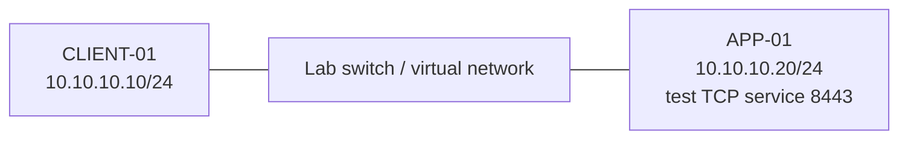

# Three-case network troubleshooting walkthrough

**Status:** Planned lab walkthrough — no scenario results recorded

## Fictional support setting

An office user on `CLIENT-01` reports that a service on `APP-01` is unavailable. We use the toolkit to record what the client can actually reach, then compare DNS, ICMP, TCP, and local path evidence. This is an **isolated two-VM lab**, not a production incident.



Use the [Project 07 toolkit](../README.md) on CLIENT-01. Map the IPs and interfaces to the actual lab; the addresses above are private examples. Confirm both VMs can reach each other before injecting a fault. Use a separate management console so a failed network check does not prevent recovery.

## Prepare one known-good baseline

1. On APP-01, choose an unused TCP port and start a temporary listener. The example uses 8443. Keep this PowerShell window open during the baseline and case 2. It accepts and closes connections; it does not serve an application protocol.
2. If Windows Firewall blocks the lab traffic, add a narrowly scoped inbound allow rule on APP-01 for TCP 8443 from CLIENT-01. Check the actual network profile before using the `Private` example below. Admin rights are required for firewall changes.
3. From CLIENT-01, verify the expected IP, ICMP, TCP, and local-context results. The local-context cmdlets may be denied by Windows or the execution environment; record that status without treating it as a remote connectivity failure.

APP-01 listener:

```powershell
$labListener = [System.Net.Sockets.TcpListener]::new([System.Net.IPAddress]::Parse('10.10.10.20'), 8443)
$labListener.Start()
try {
    while ($true) {
        $labClient = $labListener.AcceptTcpClient()
        $labClient.Dispose()
    }
}
finally {
    $labListener.Stop()
}
```

APP-01 firewall rule, **only if needed in this isolated lab**:

```powershell
New-NetFirewallRule -DisplayName 'LAB-Toolkit-Allow-8443' -Direction Inbound `
    -Protocol TCP -LocalPort 8443 -RemoteAddress 10.10.10.10 `
    -Action Allow -Profile Private
```

CLIENT-01 baseline:

```powershell
$tool = './projects/07-network-diagnostics-toolkit/src/Invoke-NetworkDiagnostic.ps1'
& $tool -Target 10.10.10.20 -TcpPort 8443 -IncludeLocalContext | Format-List
```

Record whether `TcpStatus` is `Succeeded`. If the baseline fails, fix the lab setup before starting a fault case. The TCP result proves a connection was accepted on that port; it does not prove an application is healthy.

## Case 1 — the service name does not resolve

**Fictional report:** “The application hostname stopped working.” Use an intentionally absent lab name such as `missing.lab.invalid`, after confirming that this name is not configured in the lab resolver.

```powershell
& $tool -Target missing.lab.invalid -TcpPort 8443 -IncludeLocalContext | Format-List
```

| Check | Pattern to look for | Observed in your lab |
| --- | --- | --- |
| Name resolution | `Failed` | Not yet run |
| ICMP and TCP | `NotRun` because there is no selected address | Not yet run |
| Local context | `NotRun`; a target route cannot be selected | Not yet run |

Next, check spelling and suffix, the intended DNS record, and the client resolver configuration. On CLIENT-01, `Get-DnsClientServerAddress` identifies configured DNS servers; `Resolve-DnsName` can test the intended name directly. A failed lookup alone does not distinguish a missing record from an unreachable or incorrect resolver. Restore the intended lab name or use the known IP to continue with the other cases. Do not alter production DNS for this exercise.

## Case 2 — ICMP blocked while TCP works

**Fictional report:** “Ping fails, so the app must be down.” Begin with the known-good IP and listener baseline. On APP-01, block only ICMPv4 echo requests from CLIENT-01 in this isolated lab. Check the profile and existing rules before applying the example.

```powershell
New-NetFirewallRule -DisplayName 'LAB-Toolkit-Block-Echo' -Direction Inbound `
    -Protocol ICMPv4 -IcmpType 8 -RemoteAddress 10.10.10.10 `
    -Action Block -Profile Private
```

On CLIENT-01:

```powershell
& $tool -Target 10.10.10.20 -TcpPort 8443 -IncludeLocalContext | Format-List
```

| Check | Pattern to look for | Observed in your lab |
| --- | --- | --- |
| Name resolution | `NotNeeded` for the IP literal | Not yet run |
| ICMP | `Failed` | Not yet run |
| TCP 8443 | `Succeeded` while listener and firewall allow rule remain active | Not yet run |
| Local context | Selected source/interface/route, or a recorded `Unavailable`/`Partial` status | Not yet run |

The defensible statement is **ICMP echo failed but TCP 8443 connected**. Confirm the rule caused the ICMP change, then remove it and repeat the check:

```powershell
Remove-NetFirewallRule -DisplayName 'LAB-Toolkit-Block-Echo'
```

## Case 3 — host responds but TCP service is unavailable

**Fictional report:** “The server answers ping, but the service still fails.” First restore ICMP and confirm the baseline. Then stop the temporary APP-01 listener with Ctrl+C while leaving the VM online. Re-run the CLIENT-01 check.

```powershell
& $tool -Target 10.10.10.20 -TcpPort 8443 -IncludeLocalContext | Format-List
```

| Check | Pattern to look for | Observed in your lab |
| --- | --- | --- |
| ICMP | `Succeeded`, if echo is allowed | Not yet run |
| TCP 8443 | `Failed` or `TimedOut`, depending on host and firewall behavior | Not yet run |
| Local context | Compare source interface and route with the baseline | Not yet run |

Check whether APP-01 is listening on 8443, whether the correct port was requested, and whether a firewall or path policy blocks the connection. In this controlled case, stopping the listener is the known injection; avoid claiming the toolkit discovered a production root cause. Restart the listener to verify that TCP returns to `Succeeded`.

## Restore and record evidence

On APP-01, stop the test listener and remove only the named lab firewall rules you created. Check for a pre-existing rule with the same name before creating either rule; do not remove someone else's rule. Confirm the original lab network state and any management connection. For a rule you created in this walkthrough:

```powershell
Remove-NetFirewallRule -DisplayName 'LAB-Toolkit-Allow-8443'
```

Record results in the table below; keep timestamps and exact commands with sanitized output if you want portfolio evidence.

| Case | Date / platform | Expected pattern matched? | Actual DNS / ICMP / TCP | Local context status | Confirmed cause and restoration |
| --- | --- | --- | --- | --- | --- |
| Baseline | Not yet run | Not yet run | Not yet run | Not yet run | Not yet run |
| 1: name resolution | Not yet run | Not yet run | Not yet run | Not yet run | Not yet run |
| 2: ICMP blocked | Not yet run | Not yet run | Not yet run | Not yet run | Not yet run |
| 3: TCP unavailable | Not yet run | Not yet run | Not yet run | Not yet run | Not yet run |

Sanitize real hostnames, internal addressing, DNS server details, credentials, and screenshots before committing evidence. Mark a case complete only after it has been run and the observations are recorded.

## Command references

- [Microsoft New-NetFirewallRule](https://learn.microsoft.com/en-us/powershell/module/netsecurity/new-netfirewallrule?view=windowsserver2025-ps)
- [Microsoft Remove-NetFirewallRule](https://learn.microsoft.com/en-us/powershell/module/netsecurity/remove-netfirewallrule?view=windowsserver2025-ps)
- [Microsoft Get-NetIPConfiguration](https://learn.microsoft.com/en-us/powershell/module/nettcpip/get-netipconfiguration?view=windowsserver2025-ps)
